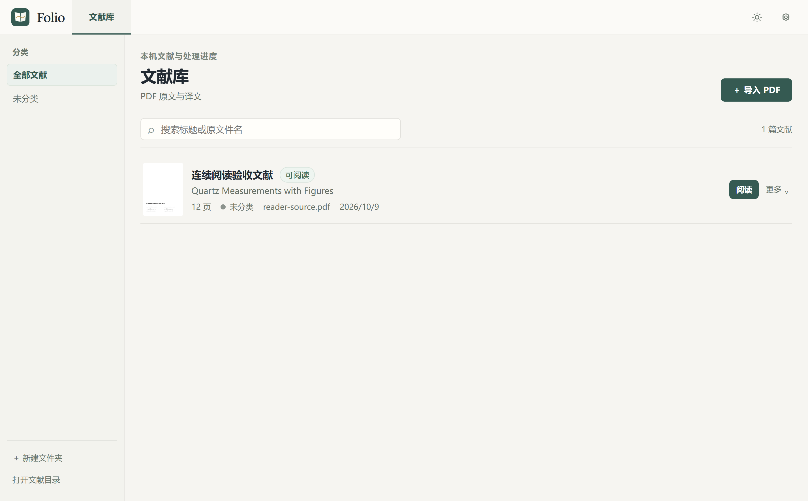
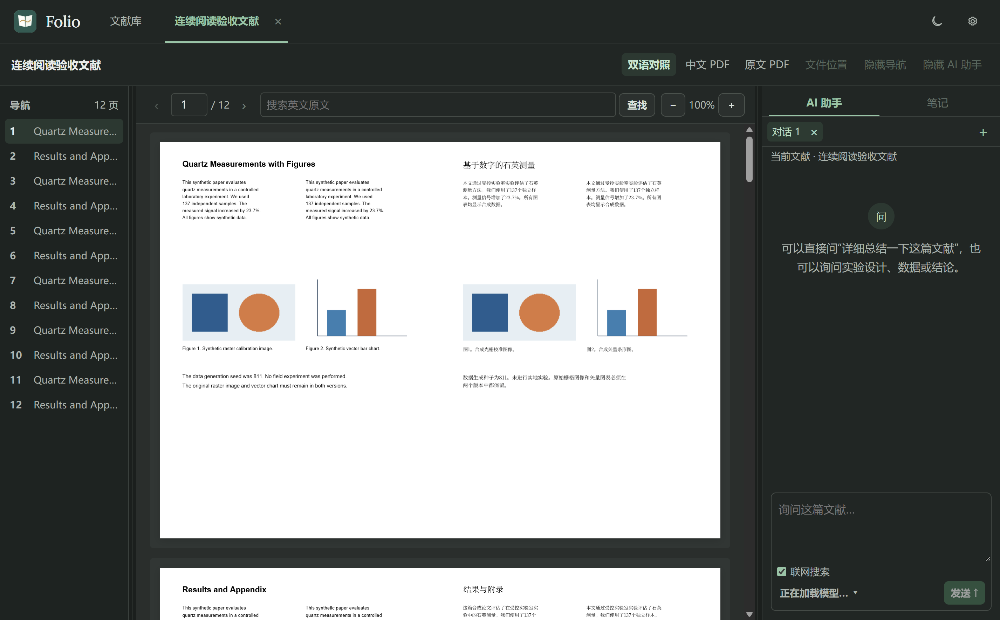
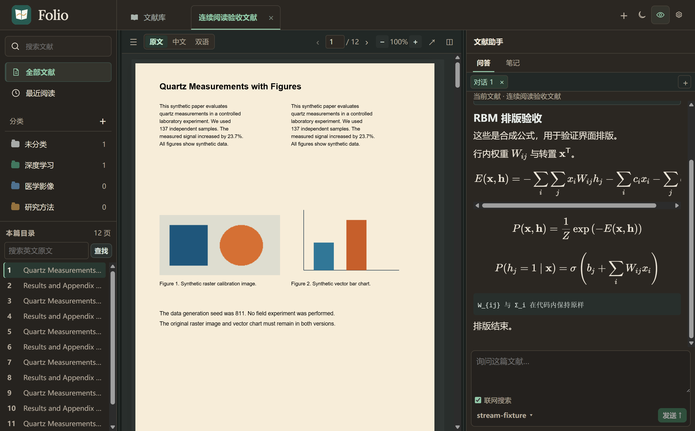
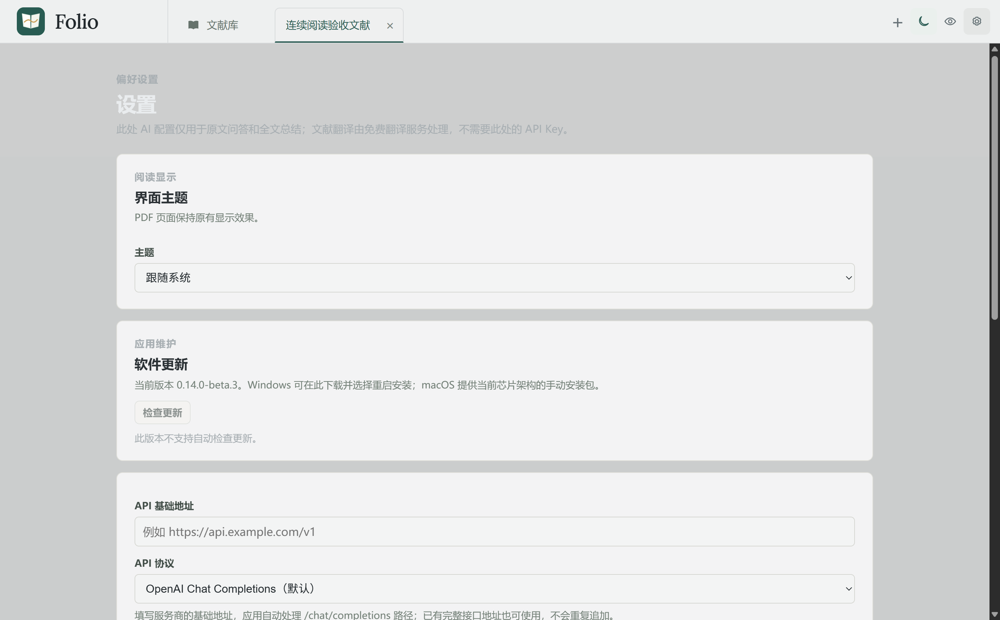
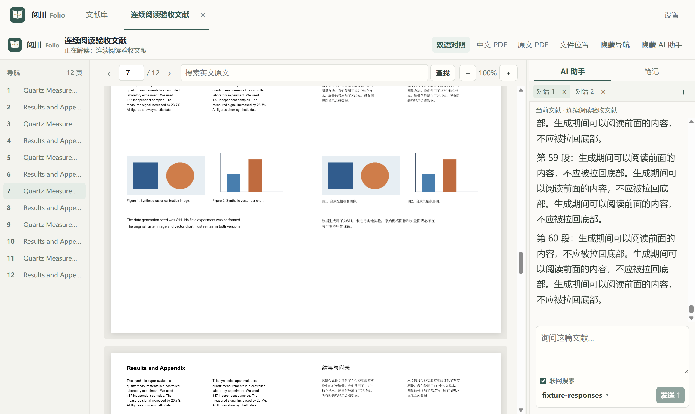

<p align="center">
  
</p>

# Folio

一个桌面文献阅读工作台。英文 PDF 导入后先完成全文翻译，中文文献直接阅读原始 PDF；在同一窗口中结合 AI 问答、笔记和批注理解文献。

**当前版本：Windows x64 1.0.2 / macOS arm64、x64 0.14.0-beta.3 · Electron + React + Python**

[功能](#功能) · [界面预览](#界面预览) · [使用](#使用) · [AI 配置](#ai-配置) · [源码构建](#源码构建) · [数据与隐私](#数据与隐私) · [当前限制](#当前限制)

## 功能

| 功能 | 说明 |
| --- | --- |
| 导入与归类 | 选择或拖入 PDF；按中文标题重命名库内副本；相同文件去重；文件夹使用持久颜色标签 |
| 阅读外观 | 浅色、深色或跟随系统，约 0.4 秒柔和过渡；独立护眼模式可叠加深色，让界面与 PDF 显示偏暖，不修改 PDF 文件 |
| 全文翻译 | 英文文献使用 PDF2zh-Next / BabelDOC 和免费翻译服务，生成中文 PDF 与左右双语 PDF；检测为中文的正文跳过翻译 |
| 原版阅读 | 连续滚动、高清绘制、缩放、页码跳转和原文查找；切换原文、中文、双语 PDF 保持当前页 |
| 文献标签 | 多篇文献在顶部标签间切换；关闭标签保留文献，阅读页码和聊天按文献隔离 |
| 三栏布局 | 导航、正文、助手可拖动调整比例；拖动时预览栏宽，松手后重排 PDF 并保持阅读位置；导航和助手可独立隐藏，布局会保存 |
| AI 文献助手 | 可选择 Chat Completions 或 Responses 协议；读取模型列表后选择；按需读取正文或发送全文总结 |
| 独立会话 | 同一篇文献可新建、切换和删除多个 AI 会话；各自保存记录，切换不中断生成 |
| 流式与联网 | 实时显示回答和服务返回的思考；可停止生成；向上阅读暂停自动滚动；免 Key 搜索、Markdown 和 LaTeX 公式 |
| 阅读笔记 | 每篇文献独立笔记，自动保存和草稿恢复；选中文字后右键添加四色高亮、下划线或批注，支持编辑、删除及跳转定位 |
| 句子翻译 | 选中 PDF 文字后右键翻译为简体中文，在可移动、可关闭的小窗口显示结果 |
| 自定义存储 | 选择新的空文件夹，复制、校验并切换文献库；保留旧目录，迁移后无需重新填写 AI Key |
| 软件更新 | Windows 支持免费代理与差分下载，失败回退，可取消并手动确认重启安装；macOS 提供当前架构的手动下载 |
| 文件定位 | 在资源管理器中打开文献目录，或定位选中原文、中文和双语 PDF，便于分享 |

全文翻译使用免费服务，AI 问答使用你配置的模型，费用由相应服务商决定。翻译会适配中文文字的字号与换行，并尽量保留页面结构和图表；不承诺复杂论文逐像素一致。

## 界面预览

文献库与阅读截图记录 0.14.0-beta.3 的界面，使用合成测试文献；设置截图中的 API Key 输入框为空。

**浅色主题文献库与分类**



**深色主题阅读与 AI 助手**



**深色主题叠加护眼模式**



**深色主题设置与更新入口**



<details>
<summary>查看较早版本的 AI 公式与会话功能截图</summary>

以下图片记录较早版本的功能，不代表当前界面外观。




</details>

## 使用

源码、构建脚本和静态资源位于本仓库，安装包放在 [GitHub Releases](https://github.com/G-mas66/folio/releases)。无需克隆项目或自行安装 Python；根据系统下载对应包。

| 系统 | 安装包 | 安装方式 |
| --- | --- | --- |
| Windows x64 | [Folio-1.0.2-Windows-x64-Setup.exe](https://github.com/G-mas66/folio/releases/download/v1.0.2/Folio-1.0.2-Windows-x64-Setup.exe) | 运行安装程序，可选择安装目录 |
| Mac · Apple Silicon | [Folio-0.14.0-beta.3-macOS-arm64.zip](https://github.com/G-mas66/folio/releases/download/v0.14.0-beta.3/Folio-0.14.0-beta.3-macOS-arm64.zip) | 解压，将 `.app` 拖入「应用程序」 |
| Mac · Intel | [Folio-0.14.0-beta.3-macOS-x64.zip](https://github.com/G-mas66/folio/releases/download/v0.14.0-beta.3/Folio-0.14.0-beta.3-macOS-x64.zip) | 解压，将 `.app` 拖入「应用程序」 |

发布页附有各平台验收报告及校验清单：[Windows 1.0.2](https://github.com/G-mas66/folio/releases/download/v1.0.2/SHA256SUMS.txt)、[macOS beta.3](https://github.com/G-mas66/folio/releases/download/v0.14.0-beta.3/SHA256SUMS.txt)。

Windows 1.0.2 的更新检查修复、安装升级与发布检查见[验收记录](docs/Folio-1.0.2-验收报告.md)；PDF 标记与助手布局的详细回归见 [1.0.1 验收记录](docs/Folio-1.0.1-验收报告.md)。

现有 0.13.0 需要手动安装本版一次，之后 Windows 启动时会检查更新，也可在「设置 → 软件更新」手动检查。下载可以取消或重试，完成后由你点击「重启并安装」；退出应用不会自动安装。macOS 使用当前芯片架构的手动下载与替换方式。

Windows 1.0.2 检查更新时优先使用系统网络；连接、代理或超时错误会重试一次直连，结束后恢复系统代理。HTTP 和清单错误显示具体类别，脱敏诊断写入界面数据目录的更新日志。旧客户端若无法检查更新，可手动安装一次新版。安装包继续使用代理与差分下载：优先经 ghfast.top 下载安装包及 blockmap，失败依次回退 ghproxy.net、GitHub；版本清单与 SHA-512 校验值仍来自官方 GitHub。beta.4 和 1.0.0 客户端可在软件更新中升级，也可[通过免费代理手动下载 1.0.2](https://ghfast.top/https://github.com/G-mas66/folio/releases/download/v1.0.2/Folio-1.0.2-Windows-x64-Setup.exe)。安装新版并启动后，应用联网获取当前版本的官方清单并校验，删除已安装更新的重复缓存，保留一份当前安装包供下次差分使用。尚未安装的新版包会保留；清单暂时不可用时，下次启动再尝试清理。

macOS 为测试版，采用 ad-hoc 签名，没有 Apple Developer ID 签名或公证。首次打开可能被 Gatekeeper 阻止，可按照系统「隐私与安全性」提示允许打开；真实用户机器上的首次安装流程尚未验证。

自行构建后的 Windows 安装包路径：

```text
dist/installer-1.0.2/Folio-1.0.2-Windows-x64-Setup.exe
```

界面品牌使用 Folio；Windows 可执行文件名和默认安装目录仍保留旧名称，以便覆盖现有安装并继续使用原来的用户数据与凭据身份。

也可使用 `dist/installer-1.0.1/win-unpacked/阅川 Folio.exe`；需要保留整个 `win-unpacked` 文件夹。打包程序包含本地服务、Python 运行时、PDF 引擎、字体和布局模型，使用时不用手动启动 Python 或另装 Python。

1. 在文献库创建分类文件夹，然后导入 PDF。程序保存库内副本，最初选择的文件保持不变。
2. 英文文献等待中文和双语 PDF 生成；中文文献直接阅读。英文翻译可暂停、继续或重试，不需要逐段点击翻译。
3. 点击「阅读」，在顶部文献标签中切换。选择原文、中文或双语对照，按需调整三栏宽度。
4. 选中同一页内的文字后右键，添加高亮、下划线或批注，或在小窗口翻译选中的句子；右侧点击「笔记」图标记录阅读心得。
5. 如需 AI 问答，在「设置」完成接口配置，再在助手中提问或总结。同一篇文献可用助手顶部会话旁的 ＋ 新建会话，× 删除会话；问答与笔记使用图标切换。

文献卡片的「打开文件位置」定位原文副本，阅读窗口的「文件位置」定位当前版本的 PDF。分类属于数据库中的逻辑归类，不是实体文件夹；「打开文献目录」打开当前文献库的 `papers` 目录。

删除文献需要确认，会删除库内 PDF、副本、聊天、笔记及批注，并关闭对应标签；原始导入文件保持不变。删除分类文件夹只将文献移到「未分类」，不会删除文献。

## AI 配置

模型和服务需要支持所选协议、工具调用（tools）及流式返回（SSE）。

在「设置」填写：

| 配置项 | 填写方式 |
| --- | --- |
| API 基础地址 | 例如 `https://api.example.com/v1`，替换为服务商提供的地址 |
| API 协议 | 默认 OpenAI Chat Completions；也可选择 OpenAI Responses |
| 默认模型 | 点击「获取模型列表」后从下拉菜单选择，无需手动输入名称 |
| AI API Key | 服务商提供的 Key，保存到 Windows 凭据管理器或 macOS 钥匙串 |

标准协议根据基础地址处理 `/chat/completions` 或 `/responses` 路径，已包含端点时不会重复追加，查询参数保留。服务使用特殊对话地址时可选择「自定义完整地址（Chat Completions）」；此模式按填写的完整 URL 原样请求，保留尾斜线与查询参数。旧自定义地址升级后保留原样请求模式。

获取模型列表只读取服务提供的目录，不逐个发起推理。公开列表尝试无 Key 查询，需要鉴权的列表使用本次输入或已保存 Key。返回的模型可直接选为默认，也可勾选加入常用列表。服务未提供列表时，在「高级：手动添加模型」输入模型 ID；特殊目录地址也可在高级选项填写。阅读助手底部显示当前模型，点击名称旁的箭头切换。

### 助手如何读取论文

- 普通首轮请求发送文献基本信息和近期对话，不自动发送全文或页面图片。
- 模型调用 `read_paper` 时，工作台返回当前文献相关的可提取原文。
- 模型调用 `summarize_paper` 时，工作台一次发送完整可提取原文与页码标记。新总结不分块、不静默截断；超过服务的输入容量时显示失败，允许重试。
- 开启「联网搜索」时，模型可调用 `web_search`，使用免 Key 的 Bing RSS 搜索；关闭后本轮不提供搜索工具。搜索可用性受网络和站点限制。

回答中的有效论文引用可跳转到对应页，网页引用可以打开来源链接。Markdown 支持标题、列表、表格、代码块及 LaTeX 公式；旧回答中的普通文字公式不会自动改写。思考内容只展示服务商实际返回的字段，未返回时不伪造。点击「停止生成」会关闭当前流式请求，已收到内容保留并标为未完成。

流式生成时向上滚动会暂停自动跟随，便于阅读前面的内容；滚回底部或点击「回到最新」恢复跟随。每个会话保存独立上下文和阅读位置；旧聊天记录归入默认会话。删除正在生成的会话前需先停止，删除不会影响文献或笔记。

## 笔记与存储

每篇文献的阅读笔记独立保存。输入先保留为本地草稿，再延迟保存到数据库，也可点击「保存笔记」。高亮、下划线和批注按原文、中文、双语 PDF 版本及页码分别保存，列表中可以编辑、删除或定位。选择文字时不会自动弹出菜单；在选区内右键才显示操作。

高亮、下划线和批注是工作台内的覆盖显示，不改写原 PDF；当前没有带标注 PDF 导出功能。笔记与批注不自动发送给 AI。点击句子翻译时，仅将选中文字发送给现有免费翻译服务，无需 AI Key。

Windows 默认文献库位于 `D:\个人工作台\data`；macOS 默认位于 `~/Library/Application Support/阅川 Folio/data`。AI Key 分别保存在 Windows 凭据管理器和 macOS 钥匙串。在「设置 → 文献存储位置」点击「更改存储位置…」，选择一个空文件夹，确认后执行：

1. 停止当前任务和本地服务。
2. 复制 PDF、数据库、分类、聊天、笔记、批注及引擎缓存，并逐文件校验。
3. 校验成功后切换位置并重启。迁移失败时保留原配置并尝试恢复原服务。

旧目录会保留。Electron 界面数据和凭据身份仍使用原位置，因此迁移后不能把旧目录整体视为可随意删除的副本。安装位置不随文献库改变，卸载不会自动删除文献数据。

## 源码构建

### 环境

- Windows x64，Git。
- Node.js 22.12 或更高版本；当前应用使用本地 Electron 38.8.6 验证。
- Python 3.12，可通过 `py -3.12` 调用。
- 首次安装依赖需要联网。仓库含字体和布局模型，克隆体积约数百 MB；虚拟环境和安装包会额外占用磁盘空间。

以下以 `D:\个人工作台` 为项目目录，将依赖、缓存和构建临时文件放在该目录中：

```powershell
git clone https://github.com/G-mas66/folio.git 'D:\个人工作台'
Set-Location 'D:\个人工作台'

New-Item -ItemType Directory -Force .cache\npm, .cache\electron, .cache\electron-builder, .cache\pip, .cache\build-temp | Out-Null
$env:npm_config_cache = Join-Path $PWD '.cache\npm'
$env:ELECTRON_CACHE = Join-Path $PWD '.cache\electron'
$env:ELECTRON_BUILDER_CACHE = Join-Path $PWD '.cache\electron-builder'
$env:PIP_CACHE_DIR = Join-Path $PWD '.cache\pip'
$env:TEMP = Join-Path $PWD '.cache\build-temp'
$env:TMP = $env:TEMP
$env:TMPDIR = $env:TEMP

py -3.12 -m venv .venv
npm ci
.\.venv\Scripts\python.exe -m pip install -r .\backend\requirements.txt
npm run dist
```

`npm run dist` 依次构建界面、本地后端与 PDF 引擎，再生成 NSIS 安装包。PDF 引擎构建会准备 `.venv-pdf-engine`，使用 PDF2zh-Next **2.9.0**、BabelDOC **0.6.2** 和 PyInstaller **6.16.0**。1.0.1 Windows 的安装包目录为 `dist/installer-1.0.1/`。

### macOS 测试版

0.14.0-beta.3 macOS 测试版支持 Apple Silicon arm64 和 Intel x64。GitHub Actions 的「macOS Test Builds」工作流只接受手动运行，使用标准 `macos-15` 与 `macos-15-intel` runner 原生构建，并运行后端契约测试和打包应用 smoke。默认仅在 Actions 日志中保留测试报告，不上传大型 Actions artifact；勾选 `create_draft_release` 会在重新构建并验证后，把 zip 安装包和逐架构 smoke 报告放到草稿预发布中。

macOS 本地构建需要对应架构的 Mac、Xcode Command Line Tools、Node.js 22 和 Python 3.12：

```bash
npm ci
MAC_ARCH=arm64 npm run dist:macos
```

Intel Mac 将 `arm64` 改为 `x64`。产物位于 `dist/macos-test-0.14.0-beta.3-<架构>/`。应用自带原生后端、PDF 翻译引擎、字体和布局模型，不需要用户安装 Python。测试版使用临时 ad-hoc 签名，没有 Developer ID 签名或公证；首次打开可能出现 Gatekeeper 提示，因此只作为测试包分发。macOS 更新不会自动替换应用，需要下载当前架构的 zip 并手动安装。

### 开发运行

在上述依赖与 PDF 引擎已准备好后：

```powershell
npm run dev
```

这是 Electron 桌面开发模式，Vite 页面由桌面窗口加载。单独运行前端页面不具备 Electron 桥接能力，不能代替完整应用。

Windows 默认数据和位置配置使用 D 盘路径。如果你的机器没有 D 盘，源码运行前可设置绝对路径：

```powershell
$env:WORKBENCH_DATA_DIR = 'C:\FolioData'
$env:WORKBENCH_LOCATION_CONFIG = 'C:\FolioConfig\location.json'
npm run dev
```

这两个变量分别指定初始文献库和位置配置文件，应用的文献位置设置仍可用于后续迁移。

### 验证

首次运行契约检查，先生成不含个人信息的合成 PDF：

```powershell
.\.venv\Scripts\python.exe -m pip install reportlab
.\.venv\Scripts\python.exe -m review.make_review_pdfs
npm run test:backend
npm run test:storage
npm run test:updates
```

Windows x64 0.14.0-beta.1 后端检查 **124 项通过、1 项 POSIX 专用检查跳过**，13 项存储文件系统检查通过。最终打包程序通过深浅主题、系统标题栏、真实 PDF 翻译、文献标签、独立会话、模型与三栏布局验收；笔记、批注、公式、流式停止和存储迁移也已回归。两个不同已安装测试版本完成本地更新源下的检测、下载、取消重试、重启安装及数据保留检查。兼容接口测试使用隔离的模拟服务，不代表任何第三方模型的回答质量。

macOS arm64 与 x64 的 beta.1 在 [原生云端验收](https://github.com/G-mas66/folio/actions/runs/37814249355) 中分别通过 **125 项后端检查和 13 项存储检查**。两种打包应用均验证了启动、钥匙串、中文原件阅读、两种 AI 协议、文献工具、停止生成、笔记保存、更新架构匹配及实际免费翻译；中文和双语 PDF 均生成并通过输出校验。尚未验证真实用户机器上的首次安装。

`review/` 保留原生桌面验收脚本。部分脚本依赖 `.review/` 中预先生成或翻译的样本，不能在新克隆仓库中直接运行全部桌面验收；准备条件可从各脚本和种子脚本查看。历史结果和哈希记录见 [审批检查](docs/审批检查.md)，运行输出、私人文献和安装包不提交到仓库。

beta.2 仅修复 Windows 更新说明中的 HTML 标签显示，未改变安装流程或数据库。补丁的定向测试、实际 Windows 主题与标题栏检查通过；本次 Mac 架构验收和发布检查见 [beta.2 验收记录](docs/Folio-0.14.0-beta.2-验收报告.md)，完整升级与公共整包下载历史见 [beta.1 验收记录](docs/Folio-0.14.0-beta.1-验收报告.md)。

Windows beta.4 的免费代理与差分组合、缓存清理、实际隔离安装升级及公开检测均已通过；本次 beta.3 → beta.4 下载量约 13.2 MB，相对整包减少约 97.4%。公开 ghfast 差分内容重建也通过双哈希校验，单次下载、重建与校验为 17.28 秒。详见 [beta.4 Windows 验收记录](docs/Folio-0.14.0-beta.4-验收报告.md)。

Windows 1.0.1 修复双栏选区、中文标记高度与旋转页面坐标，并将助手图标、会话和新建按钮合并为一行。最终生产程序通过三种 PDF 视图、相邻两行标记、旋转/缩放、笔记与 AI 协议 GUI 回归；差分重建与安装升级结果见 [1.0.1 验收记录](docs/Folio-1.0.1-验收报告.md)。

## 项目结构

```text
src/                       React 阅读器、文献库、助手与设置
electron/                 桌面主进程、IPC 与存储迁移
backend/                   FastAPI、SQLite、AI 与翻译协调
backend/pdf_engine/        随应用运行的 PDF 翻译入口
backend/pdf_engine_assets/ 字体、布局模型和必要资源
scripts/                   Windows 与 macOS 构建脚本
review/                    契约测试、合成样本和桌面验收脚本
docs/                      方案、验收记录和界面截图
```

## 数据与隐私

- 文献、生成的 PDF、分类、聊天、笔记与批注保存在本机；导入会创建副本，不修改源文件。
- 免费翻译服务会接收标题和可提取的正文文本；AI 服务会接收对话及模型调用工具取得的原文。两者都属于外部服务，完整生成的 PDF 可以离线阅读。
- API Key 保存到 Windows 凭据管理器或 macOS 钥匙串，不写入应用数据库，不回读显示，不随文献目录复制。
- 联网搜索只发送搜索关键词，不发送整篇论文或 AI Key；网页来源由用户点击后打开。
- 原始 HTML 不执行，远程回答图片不自动加载，只显示图片说明。
- `.gitignore` 排除文献库、位置配置、环境文件、虚拟环境、缓存、安装目录和构建输出。界面截图使用合成样本。

## 当前限制

- Windows x64 当前为 1.0.1；macOS arm64/x64 继续使用已验收的 beta.3 测试版，目前没有 Apple Developer ID 签名或公证；Linux 未验证。
- 扫描件和无法提取正文的实质页面会阻止完成，当前没有单独 OCR 步骤。
- 表格单元格、图片内文字和公式不会被完整翻译；复杂公式、跨页图表和特殊排版应检查输出。
- 高亮、下划线、批注与句子翻译支持同一页内的可提取文字，不支持跨页选择或扫描图上的文字选择。
- 旧版已保存的标记坐标不自动按文字搜索迁移；历史标记若仍有偏移，需要删除后重新标记。
- 全文总结容量由所选模型与服务决定；读取模型列表也取决于服务是否提供相应接口。
- 免费翻译和免 Key 搜索依赖第三方服务，不保证长期可用或固定速度。

## 第三方组件

PDF 布局翻译使用 **PDF2zh-Next 2.9.0** 和 **BabelDOC 0.6.2**，两者采用 **AGPL-3.0**。构建安装包时会附带对应源代码与许可证，位于安装资源的 `pdf-engine-source/`。前端使用 PDF.js、React、react-markdown 和 KaTeX。

参见 [THIRD-PARTY-NOTICES.md](THIRD-PARTY-NOTICES.md)。第三方组件与资源的授权以各自许可证为准。
