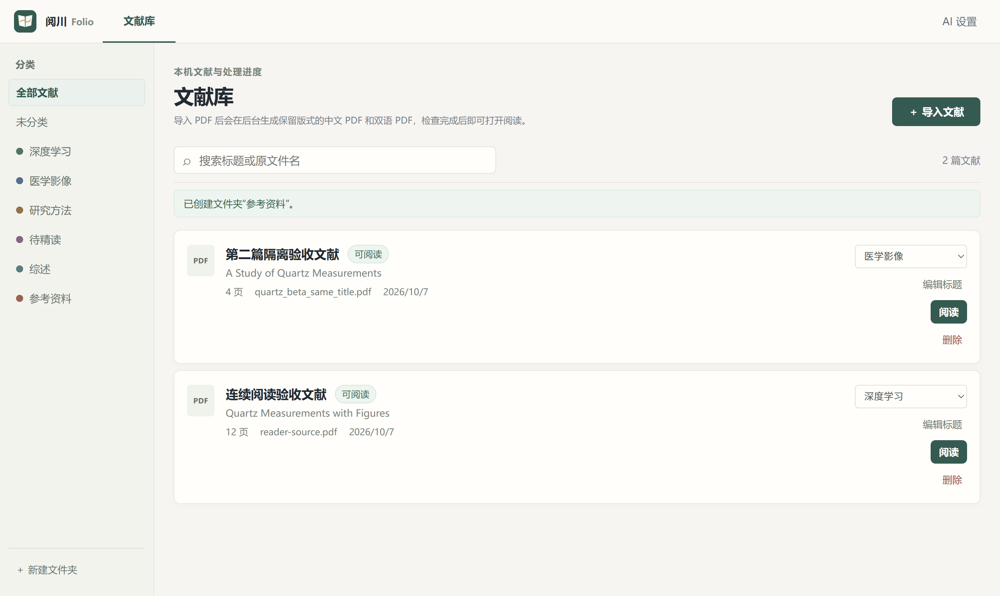
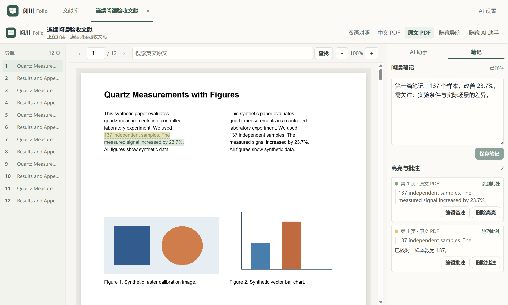

<p align="center">
  
</p>

# 阅川 · Folio

一个面向英文论文的 Windows 桌面阅读工作台。导入 PDF 后先完成全文翻译，再在同一窗口中阅读原文、中文或双语对照，结合 AI 问答、笔记和批注理解文献。

**当前版本：0.11.0 · Windows x64 · Electron + React + Python**

[功能](#功能) · [界面预览](#界面预览) · [使用](#使用) · [AI 配置](#ai-配置) · [源码构建](#源码构建) · [数据与隐私](#数据与隐私) · [当前限制](#当前限制)

## 功能

| 功能 | 说明 |
| --- | --- |
| 导入与归类 | 选择或拖入 PDF；按中文标题重命名库内副本；相同文件去重；文件夹使用持久颜色标签 |
| 全文翻译 | 使用 PDF2zh-Next / BabelDOC 和免费翻译服务，生成真正的中文 PDF 与左右双语 PDF，处理完成后开放阅读 |
| 原版阅读 | 原文、中文、双语三种模式；连续滚动、高清绘制、缩放、页码跳转和英文原文查找 |
| 文献标签 | 多篇文献在顶部标签间切换；关闭标签保留文献，阅读页码和聊天按文献隔离 |
| 三栏布局 | 导航、正文、助手可拖动调整比例；导航和助手可独立隐藏，布局会保存 |
| AI 文献助手 | 接入 OpenAI Chat Completions 兼容接口；按需读取正文或一次发送完整原文总结；模型名称旁直接切换模型 |
| 流式与联网 | 逐步显示回答和服务返回的思考内容；可停止生成；按需调用免 Key 联网搜索；支持 Markdown 和 LaTeX 公式 |
| 阅读笔记 | 每篇文献独立笔记，自动保存和草稿恢复；四种颜色高亮、批注、编辑、删除及跳转定位 |
| 自定义存储 | 选择新的空文件夹，复制、校验并切换文献库；保留旧目录，迁移后无需重新填写 AI Key |

全文翻译使用免费服务，AI 问答使用你配置的模型，费用由相应服务商决定。翻译会适配中文文字的字号与换行，并尽量保留页面结构和图表；不承诺复杂论文逐像素一致。

## 界面预览

以下均为实际桌面应用截图，使用合成测试文献，不包含个人文献或 API Key。

**文献库与彩色分类**



**正文阅读、高亮与独立笔记**



<details>
<summary>查看 AI 助手、公式排版和模型切换</summary>


</details>

## 使用

本仓库提供源码和构建所需的静态资源，生成的安装程序不提交到 Git。安装包可按下方[源码构建](#源码构建)步骤生成。

构建完成后运行：

```text
dist/installer-0.11.0/阅川-Folio-0.11.0-安装程序.exe
```

也可使用 `dist/installer-0.11.0/win-unpacked/阅川 Folio.exe`；需要保留整个 `win-unpacked` 文件夹。打包程序包含本地服务、Python 运行时、PDF 引擎、字体和布局模型，使用时不用手动启动 Python 或另装 Python。

1. 在文献库创建分类文件夹，然后导入 PDF。程序保存库内副本，最初选择的文件保持不变。
2. 等待中文和双语 PDF 生成完成。处理可暂停、继续或重试，不需要逐段点击翻译。
3. 点击「阅读」，在顶部文献标签中切换。选择原文、中文或双语对照，按需调整三栏宽度。
4. 选中同一页内的文字，添加高亮或批注；右侧切换到「笔记」记录阅读心得。
5. 如需 AI 问答，在「AI 设置」完成接口配置，再在助手中提问或总结。

删除文献需要确认，会删除库内 PDF、副本、聊天、笔记及批注，并关闭对应标签；原始导入文件保持不变。删除分类文件夹只将文献移到「未分类」，不会删除文献。

## AI 配置

模型和服务需要支持 **Chat Completions、工具调用（tools）及流式返回（SSE）**。

在「AI 设置」填写：

| 配置项 | 填写方式 |
| --- | --- |
| AI API URL | 用于发送对话请求的完整 URL，例如 `https://api.example.com/v1/chat/completions`；这是占位示例，需替换成实际地址 |
| 默认模型 | 服务商提供的模型 ID |
| AI API Key | 服务商提供的 Key，保存到 Windows 凭据管理器 |

**聊天请求原样使用你填写的 URL，不自动追加路径。** 尾斜线和查询参数也会保留。

点击「获取模型列表」可从当前地址推导模型列表地址；公开列表会尝试无 Key 查询，需要鉴权的列表使用本次输入或已保存的 Key。勾选结果后添加到常用模型，也可手动添加模型 ID。服务的列表路径不符合常见规则时，可展开高级选项填写列表地址；该地址不会覆盖聊天 URL。阅读助手输入框底部显示当前模型，点击名称旁的箭头切换。

### 助手如何读取论文

- 普通首轮请求发送文献基本信息和近期对话，不自动发送全文或页面图片。
- 模型调用 `read_paper` 时，工作台返回当前文献相关的可提取原文。
- 模型调用 `summarize_paper` 时，工作台一次发送完整可提取原文与页码标记。新总结不分块、不静默截断；超过服务的输入容量时显示失败，允许重试。
- 开启「联网搜索」时，模型可调用 `web_search`，使用免 Key 的 Bing RSS 搜索；关闭后本轮不提供搜索工具。搜索可用性受网络和站点限制。

回答中的有效论文引用可跳转到对应页，网页引用可以打开来源链接。Markdown 支持标题、列表、表格、代码块及 LaTeX 公式；旧回答中的普通文字公式不会自动改写。思考内容只展示服务商实际返回的字段，未返回时不伪造。点击「停止生成」会关闭当前流式请求，已收到内容保留并标为未完成。

## 笔记与存储

每篇文献的阅读笔记独立保存。输入先保留为本地草稿，再延迟保存到数据库，也可点击「保存笔记」。高亮和批注按原文、中文、双语 PDF 版本及页码分别保存，列表中可以编辑、删除或定位。

高亮和批注是工作台内的覆盖显示，不改写原 PDF；当前没有带标注 PDF 导出功能。笔记与批注不自动发送给 AI。

默认文献库位于 `D:\个人工作台\data`。在「AI 设置 → 文献存储位置」点击「更改存储位置…」，选择一个空文件夹，确认后执行：

1. 停止当前任务和本地服务。
2. 复制 PDF、数据库、分类、聊天、笔记、批注及引擎缓存，并逐文件校验。
3. 校验成功后切换位置并重启。迁移失败时保留原配置并尝试恢复原服务。

旧目录会保留。Electron 界面数据和凭据身份仍使用原位置，因此迁移后不能把旧目录整体视为可随意删除的副本。安装位置不随文献库改变，卸载不会自动删除文献数据。

## 源码构建

### 环境

- Windows x64，Git。
- Node.js 22.12 或更高版本；当前应用使用本地 Electron 38.8.6 验证。
- Python 3.12，可通过 `py -3.12` 调用。
- 首次安装依赖需要联网。仓库含字体和布局模型，克隆体积约数百 MB；虚拟环境和安装包会额外占用磁盘空间。

以下以 `D:\个人工作台` 为项目目录，将依赖、缓存和构建临时文件放在该目录中：

```powershell
git clone https://github.com/G-mas66/folio.git 'D:\个人工作台'
Set-Location 'D:\个人工作台'

New-Item -ItemType Directory -Force .cache\npm, .cache\electron, .cache\electron-builder, .cache\pip, .cache\build-temp | Out-Null
$env:npm_config_cache = Join-Path $PWD '.cache\npm'
$env:ELECTRON_CACHE = Join-Path $PWD '.cache\electron'
$env:ELECTRON_BUILDER_CACHE = Join-Path $PWD '.cache\electron-builder'
$env:PIP_CACHE_DIR = Join-Path $PWD '.cache\pip'
$env:TEMP = Join-Path $PWD '.cache\build-temp'
$env:TMP = $env:TEMP
$env:TMPDIR = $env:TEMP

py -3.12 -m venv .venv
npm ci
.\.venv\Scripts\python.exe -m pip install -r .\backend\requirements.txt
npm run dist
```

`npm run dist` 依次构建界面、本地后端与 PDF 引擎，再生成 NSIS 安装包。PDF 引擎构建会准备 `.venv-pdf-engine`，使用 PDF2zh-Next **2.9.0**、BabelDOC **0.6.2** 和 PyInstaller **6.16.0**。完成后产物在 `dist/installer-0.11.0/`。

### 开发运行

在上述依赖与 PDF 引擎已准备好后：

```powershell
npm run dev
```

这是 Electron 桌面开发模式，Vite 页面由桌面窗口加载。单独运行前端页面不具备 Electron 桥接能力，不能代替完整应用。

当前版本默认数据和位置配置使用 D 盘路径。如果你的机器没有 D 盘，源码运行前可设置绝对路径：

```powershell
$env:WORKBENCH_DATA_DIR = 'C:\FolioData'
$env:WORKBENCH_LOCATION_CONFIG = 'C:\FolioConfig\location.json'
npm run dev
```

这两个变量分别指定初始文献库和位置配置文件，应用的文献位置设置仍可用于后续迁移。

### 验证

首次运行契约检查，先生成不含个人信息的合成 PDF：

```powershell
.\.venv\Scripts\python.exe -m pip install reportlab
.\.venv\Scripts\python.exe -m review.make_review_pdfs
npm run test:backend
npm run test:storage
```

0.11.0 已通过 **102 项后端检查、13 项存储文件系统检查和 9 套最终打包程序桌面验收**。检查覆盖笔记/标注、存储失败回滚、模型切换、公式、流式停止、分类和标签隔离，以及真实免费翻译样本的图片与矢量图保留。

`review/` 保留原生桌面验收脚本。部分脚本依赖 `.review/` 中预先生成或翻译的样本，不能在新克隆仓库中直接运行全部桌面验收；准备条件可从各脚本和种子脚本查看。历史结果和哈希记录见 [审批检查](docs/审批检查.md)，运行输出、私人文献和安装包不提交到仓库。

## 项目结构

```text
src/                       React 阅读器、文献库、助手与设置
electron/                 桌面主进程、IPC 与存储迁移
backend/                   FastAPI、SQLite、AI 与翻译协调
backend/pdf_engine/        随应用运行的 PDF 翻译入口
backend/pdf_engine_assets/ 字体、布局模型和必要资源
scripts/                   Windows 构建与安装脚本
review/                    契约测试、合成样本和桌面验收脚本
docs/                      方案、验收记录和界面截图
```

## 数据与隐私

- 文献、生成的 PDF、分类、聊天、笔记与批注保存在本机；导入会创建副本，不修改源文件。
- 免费翻译服务会接收标题和可提取的正文文本；AI 服务会接收对话及模型调用工具取得的原文。两者都属于外部服务，完整生成的 PDF 可以离线阅读。
- API Key 保存到 Windows 凭据管理器，不写入应用数据库，不回读显示，不随文献目录复制。
- 联网搜索只发送搜索关键词，不发送整篇论文或 AI Key；网页来源由用户点击后打开。
- 原始 HTML 不执行，远程回答图片不自动加载，只显示图片说明。
- `.gitignore` 排除文献库、位置配置、环境文件、虚拟环境、缓存、安装目录和构建输出。界面截图使用合成样本。

## 当前限制

- 目前针对 Windows x64 开发与验收；macOS / Linux 未验证。
- 扫描件和无法提取正文的实质页面会阻止完成，当前没有单独 OCR 步骤。
- 表格单元格、图片内文字和公式不会被完整翻译；复杂公式、跨页图表和特殊排版应检查输出。
- 高亮与批注支持同一页内的可提取文字，不支持跨页选择或扫描图上的文字选择。
- 全文总结容量由所选模型与服务决定；读取模型列表也取决于服务是否提供相应接口。
- 免费翻译和免 Key 搜索依赖第三方服务，不保证长期可用或固定速度。

## 第三方组件

PDF 布局翻译使用 **PDF2zh-Next 2.9.0** 和 **BabelDOC 0.6.2**，两者采用 **AGPL-3.0**。构建安装包时会附带对应源代码与许可证，位于安装资源的 `pdf-engine-source/`。前端使用 PDF.js、React、react-markdown 和 KaTeX。

参见 [THIRD-PARTY-NOTICES.md](THIRD-PARTY-NOTICES.md)。第三方组件与资源的授权以各自许可证为准。
