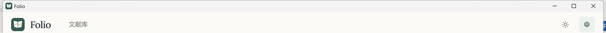
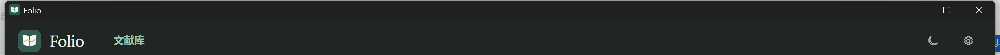

# Folio 0.14.0-beta.2 验收记录

验收日期：2026-10-09（北京时间）。安装包代码：`0acf53d4f38af05b067bc272c3ffb2113ce8048b`。

## 本次补丁

修复 Windows 从 GitHub 收到的 HTML 版本说明直接显示标签的问题。主进程转换成纯文本，保留段落、列表及常见实体，仍限制到 12,000 字符；界面继续以普通文本显示。macOS Releases API 的 Markdown 说明保持原样。本次没有修改安装流程、数据结构、凭据身份或 PDF 引擎。

## Windows 检查

- 更新说明单元检查、主进程语法检查及 Git 差异检查通过。覆盖 HTML、实体、字符串与版本数组、长度上限、普通文本比较符号、无效数字实体及 macOS Markdown。
- 实际 beta.2 生产包通过深浅主题、系统主题响应、重启保持、Lora 500 离线字标、窄窗口及 PDF 原始颜色检查。
- 实际系统标题栏截图和 DWM 标志确认菜单栏隐藏，原图标与三个窗口按钮保留，深色主题标题栏变深。
- 从 GitHub API 取得真实 `body_html`，通过模拟“发现更新”事件送入实际生产包：主进程转文本和设置页显示内容一致，没有 HTML 标签。此项为格式与界面检查，不代表发生了升级或下载。
- 包内版本、主进程与说明模块均匹配本次源码；无测试 bootstrap；随包字体及公开 beta 更新配置正确。
- 独立升级测试留下的假 API Key 已从其 D 盘测试身份删除；未更改真实安装和凭据。

Windows 安装包为 `Folio-0.14.0-beta.2-Windows-x64-Setup.exe`，504586177 字节，SHA-256：`cec060584f59b34e33d6d3805dc2eea2a32ebc23b008b7d2751a002d4f85a2a6`。`beta.yml` 版本、文件名、字节数、SHA-512 与完整本地文件一致，GitHub 草稿上传后的字节数和 SHA-256 匹配。

实际系统窗口截图（合成测试文献环境）：

## 升级验收范围

完整已安装版本 `beta.0 → beta.1` 的检测、真实下载、取消重试、笔记保存失败阻止安装、保存草稿、停止聊天和后台、重启安装、路径及数据保留已通过。公共 GitHub 整包下载和校验也已在 beta.1 通过，详见 [beta.1 验收记录](Folio-0.14.0-beta.1-验收报告.md)。

beta.2 复用相同升级生命周期，仅变更说明格式和版本号；没有重复执行 `beta.1 → beta.2` 的完整下载或安装。不能将历史升级结果表述为本次完整安装结果。

## macOS 与发布

本次使用标准 GitHub macOS runner 构建并验收两种架构：[CI 37875275627](https://github.com/G-mas66/folio/actions/runs/37875275627)。arm64 与 x64 均成功；每种架构通过 125 项后端检查、13 项存储检查，以及真实应用启动、钥匙串、引擎、AI 协议、笔记、更新架构选择和实际免费翻译。两个 PDF 输出均生成并校验通过，临时 API Key 已清理。

发布页：https://github.com/G-mas66/folio/releases/tag/v0.14.0-beta.2

0.13.0 需手动安装一次才具备应用内更新。Windows 下载后由用户确认重启安装；普通退出不安装。macOS 使用当前芯片架构的 zip 手动替换，采用 ad-hoc 签名，没有 Developer ID 签名或公证；真实用户机器的首次安装流程未验证。

## 发布附件校验

Mac 文件校验值来自 GitHub 对 CI 上传附件计算的 SHA-256；本地已核验相应 smoke 报告的哈希和内容。Windows 文件另与本地整包哈希独立比对。

| 附件 | 字节数 | SHA-256 |
| --- | --- | --- |
| Folio-0.14.0-beta.2-Windows-x64-Setup.exe | 504586177 | cec060584f59b34e33d6d3805dc2eea2a32ebc23b008b7d2751a002d4f85a2a6 |
| Folio-0.14.0-beta.2-macOS-arm64.zip | 696138781 | 5384bfdbabb598bb88879ad462a024e51a0f3a7dcf4cff065c48d30a27712af7 |
| Folio-0.14.0-beta.2-macOS-x64.zip | 708117952 | f749f802f4d8d9744cd8f5d9fe8c8ccd0141abcca26aa371cfc4dc904b5b415f |
